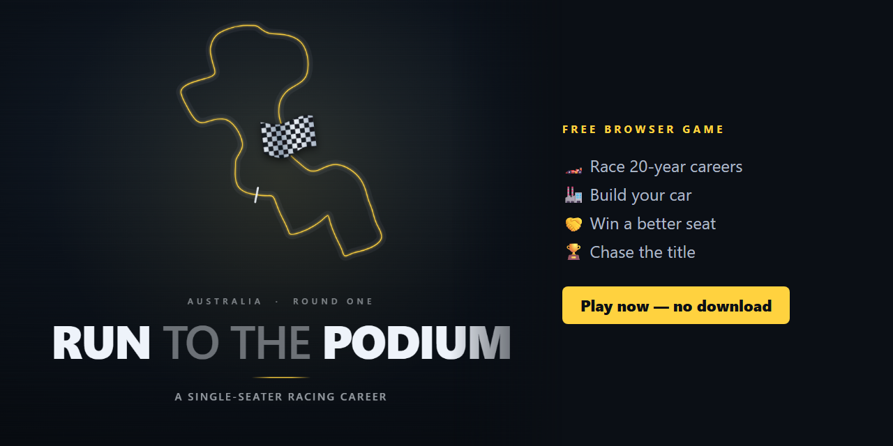
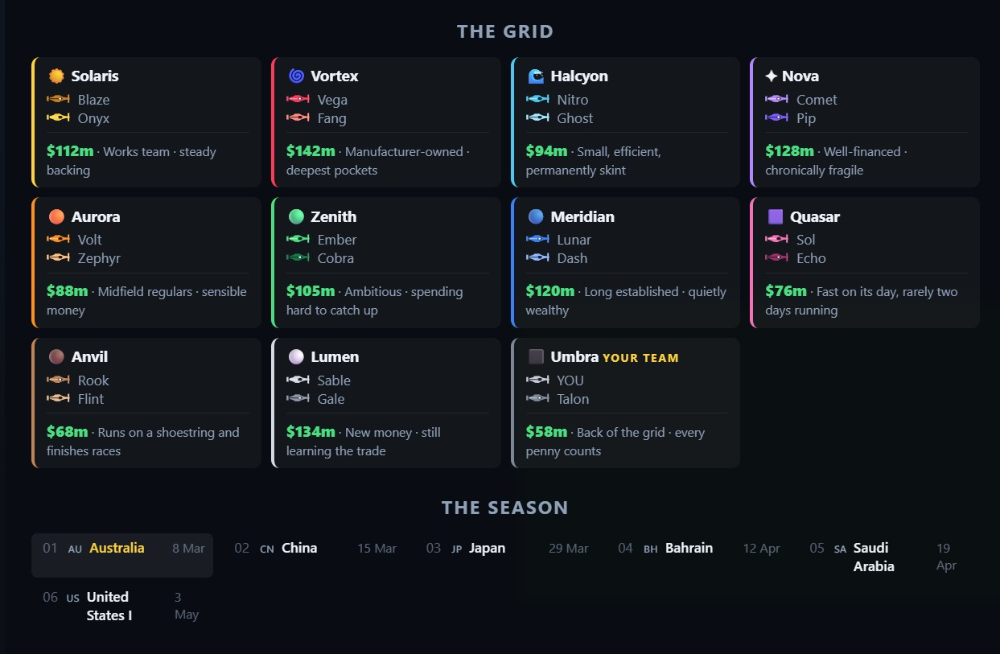
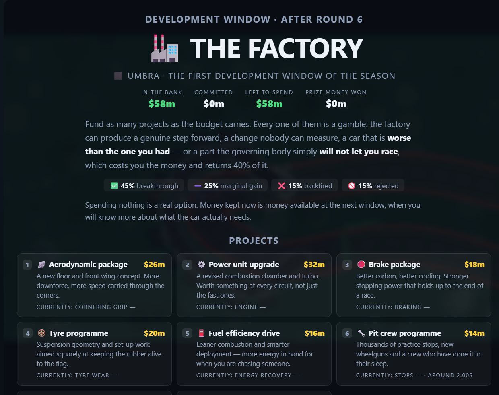
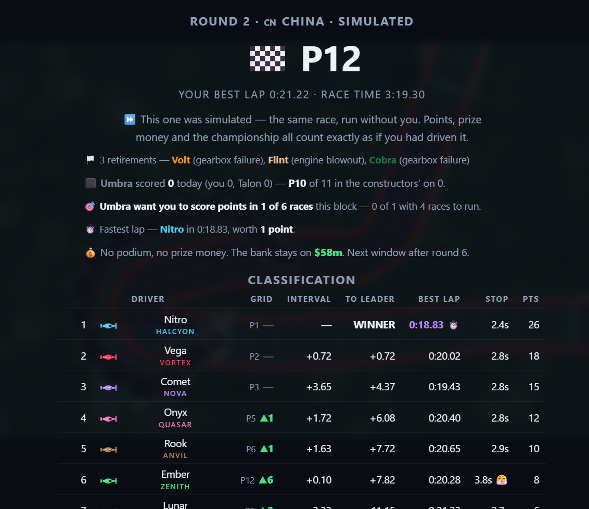

<h1 align="center">Run to the Podium</h1>

<b>A single-seater racing career you play in your browser. Free, no download, no sign-up.</b>

<a href="https://qaisfarooq.github.io/run-to-the-podium/"><b>▶ PLAY NOW</b></a>

---

You start at the back of the grid with the smallest team and the least money. Twenty seasons later, where will you be?

**Run to the Podium** mixes hands-on racing with team management. Drive every race yourself, or let one simulate. Then spend the prize money on your car, win over your team, and try to get noticed by a better one.

## Features

- 🏎️ **Real racing.** Qualifying, a formation lap, tyre choices, pit stops, damage, retirements and overtaking boost zones, all against a full grid of AI rivals.
- 🗺️ **24 circuits** traced from real-world tracks, plus special invitational events such as a speedway and a tri-oval.
- 🏭 **The Factory.** Pay for aero, engine, brake, tyre and pit-crew projects. Each one is a gamble: it might be a breakthrough or it might backfire.
- 🤝 **The silly season.** Hit your team's targets, then get offered a seat at a faster team.
- 📅 **A 20-year career** with an honours board, a history of past careers, and highlight reels you can save.
- 🎚️ **Four difficulty levels**, from Rookie to Legend.
- 📦 **One HTML file.** Download it and it plays offline, forever.

## Screenshots

| The grid | The factory | Race result |
|---|---|---|
|  |  |  |

## How to play

- **Play online:** https://qaisfarooq.github.io/run-to-the-podium/
- **Play offline:** download `index.html` (or the zip from [Releases](../../releases)) and open it in any modern browser.
- **Controls:** arrow keys to drive, **Enter** to pit, **P** to pause, **M** to mute. Menus show the other keys.

## Feedback

Found a bug or have an idea? [Open an issue](../../issues). If you enjoyed the game, a ⭐ helps other people find it.

## Credits

Created, designed and written by **Qais & Hamdan Farooq**. © 2026, all rights reserved.

Circuit layouts are traced from an MIT-licensed open circuit dataset and from public-domain Wikimedia Commons diagrams. See the notice at the top of `index.html` for details. Every team, driver and livery is invented. This is an independent fan-made game, not an official product, and it isn't associated with any racing series.
